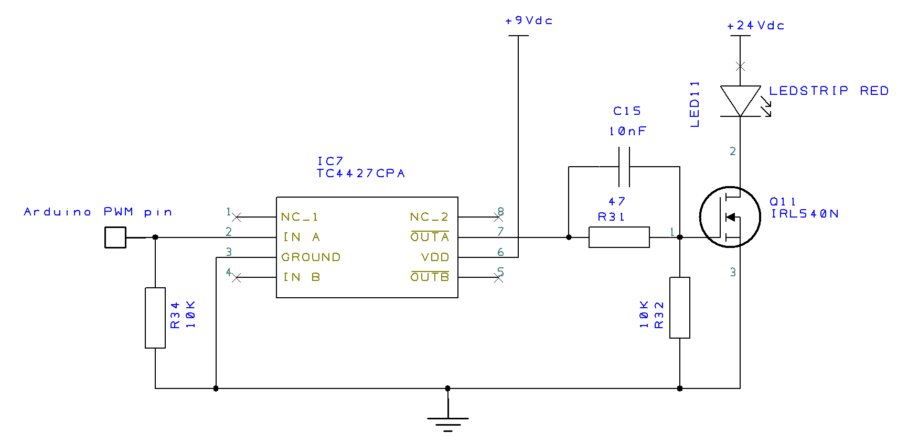

MCU<H2>2-Channel RGBWW ledstrip controller for home-assistant controlled by Arduino Giga R1 WiFi</H2>

I have been searching some time for a ledstrip controller integration in Home Assistant, which is not depending on an external app for registrations.
So I did some research and developed my own controller. 

My requirements:
- integration into Home Assistant
- no need for external internet connections
- adjustable colours and brightness
- controlled by local WiFi
- controlling 2 ledstrips individually and/or both together with 1 device

<H3>Hardware</H3>
With the release of <a href="https://store.arduino.cc/products/giga-r1-wifi">Arduino Giga R1 wifi</a> (12 PWM ports) the lack of sufficient PWM ports for controlling 2 RGBWW ledstrips from 1 device was solved 
The HA integration was working without any problems on this new hardware device. 

Second problem was the hardware interfacing. My ledstrips operate on 24VDC. 
After some testing I decided to use a fast switching MOSFET (IRL-540N) to control the ledstrip brightness with PWM.
This MOSFET has a low power dissipation and high performance. 
Because the Arduino Giga PWM output signal is only 3.3V, you need a MOSFET driver for steering the gate-source of the MOSFET with at least 5V. 
The TC4427CPA is a perfect logic non-inverting dual driver for this purpose. 

<H5>(Note:  ground any unused driver inputs to avoid a floating state)</H5>

By reducing the 24V ledstrip supply voltage to 9V with a voltage regulator (LM7809), I have both sufficient power for the Arduino's Vin and also for controlling the mosfet drivers.
So that did not require a separate power adapter. 
Because of the power dissipation in the LM7809 it could be necessary to cool it down with a sufficiently large heat sink. 
The drawing below shows the control of 1 colour of the LED strip. Click for the <a href="https://github.com/gleijten/LedstripController/blob/main/extras/Schema_cpl.png" target="_blank">complete schematic</a> and <a href="https://github.com/gleijten/LedstripController/blob/main/extras/PCB.png" target="_blank">my PCB</a>, or download the files and partlist <a href="https://github.com/gleijten/LedstripController/tree/main/DesignSpark" >here</a>. 

 
 
 

<H3>Programming</H3>
Before starting you need to have a MQTT server available in your network. I used the standard MQTT integration from Home Assistant, but any other will do fine. 
https://www.home-assistant.io/integrations/mqtt/ 
 
I used the arduino-home-assistant integration from David Chryrzynski ( https://github.com/dawidchyrzynski/arduino-home-assistant)
and editted his great 'light' and 'switch' examples for my testing program on Arduino. 
My <a href="https://github.com/gleijten/LedstripController/blob/main/Arduino/Program%20code">Arduino code</a> includes 2 channels, which can be controlled separately or together easily by switching CH2 in sync with CH1. 
Channel 2 will then follow the settings of channel 1 while the last color and brightness settings of channel 2 will be remembered until the sync switch is deactivated. 

 

 

I also included some DEBUG routines for testing purpose. 
When you choose to change the driver into an inverting type (like the TC4426 or your own driver variation with NPN transistors) you can simply activate the "invert Function" to correct the Arduino output. 
 
Intergration into Home assistant with MQTT was easy to perform. With the "Automatically add new entities" option in MQTT active, all 4 defined entities (2 lights and 2 switches) where detected and available for programming in HA.
 
See this <a href="https://github.com/gleijten/LedstripController/blob/main/HA/YAML%20code%20HA%20cardconfig">YAML code</a> for my testing dashboard (fig. above) 
